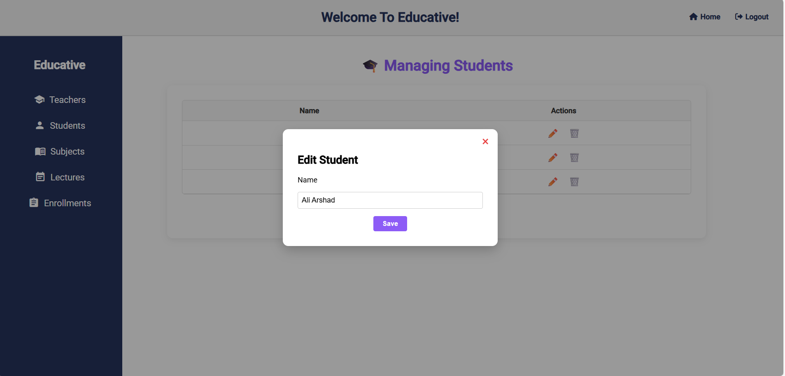
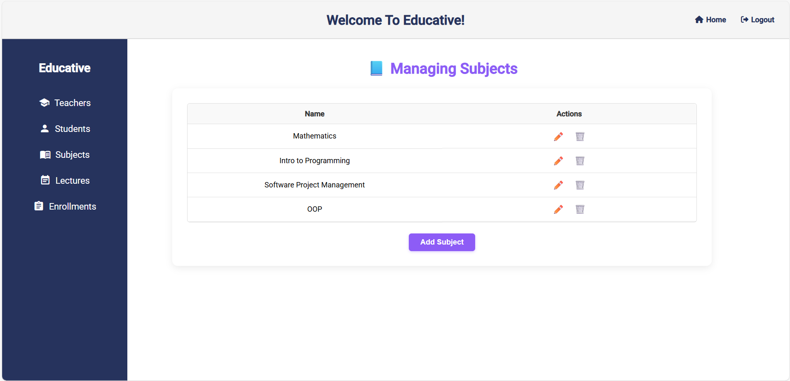

# Educative- School Management System

A full-stack School Management System built using Angular (Frontend), ASP.NET Core Web API (Backend), and SQL Server (Database).


## 🧰 Tech Stack

| Layer     | Technology                     |
|-----------|--------------------------------|
| Frontend  | Angular 16, TypeScript, HTML/CSS |
| Backend   | ASP.NET Core Web API (.NET 8), Entity Framework Core |
| Database  | SQL Server (Code-First using EF Core) |

---

## 📁 Folder Structure
```
educative-management-system/
│
├── frontend/         → Angular source code
├── backend/          → .NET Web API with models, controllers
├── screenshots/      → Project demo screenshots
└── README.md         → Project documentation
```
---

## 🚀 How to Run Locally

### ✅ Backend:
1. Open `backend/` in Visual Studio 2022.
2. Run the following commands in the Package Manager Console:
   ```
   Add-Migration Initial
   Update-Database
   ```
3. Press `F5` to run the API → should start at `https://localhost:5117`.

---

### ✅ Frontend:
1. Open `frontend/` in Visual Studio Code.
2. Install dependencies:
   ```
   npm install
   ```
3. Start the Angular development server:
   ```
   ng serve
   ```
4. Open your browser and go to:  
   `http://localhost:4200`

---

## 📸 Demo Screenshots

### Landing Page  


###  Teachers, Students and Subjects Interfaces 





### Class Lectures and Enrollments Interafces


---

## 🧠 Features

-  CRUD operations for Teachers, Students, Subjects
-  Class Lectures with subject-teacher assignment
-  Student Enrollment (max 5 lectures per student)
-  Prevents duplicate enrollments
-  Clean UI with modal forms and dropdowns

---

## 🛠️ Developer
**Maha Khurram**  
